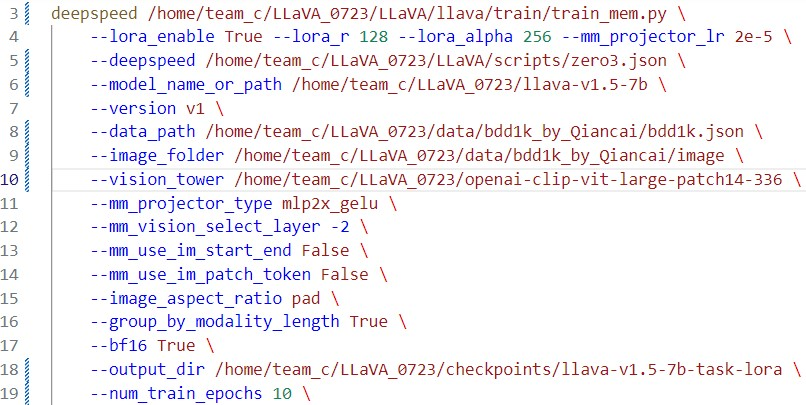

# 
大数据创新实践项目日志

多模态大模型微调实验小组C

### 7.23

##### 1) 完成远程服务器链接与环境配置

1. 服务器上项目管理、代码编写使用VScode
2. 环境配置参见Git原项目说明，anaconda环境名称`env4LLaVA`

**2) 数据、模型准备与项目文件管理**

1. 原项目克隆位置：`~/LLaVA_0723/LLaVA`

2. 训练用的数据集位置：`~/LLaVA_0723/data`

3. CLIP的vision编码层权重位置：`~/LLaVA_0723/openai-clip-vit-large-patch14-336`

4. LLaVA checkpoint中基本权重位置：`~/LLaVA_0723/llava-v1.5-7b`

   

**3) 更改部分,config/.sh文件中的路径**

1. 更改`openai-clip-vit-large-patch14-336`路径参数，参见课程操作文档
2. 训练及微调的脚本位置：`~/LLaVA_0723/LLaVA/llava/scripts/v1_5/eval/finetune_task_lora.sh`

> 负责人员：曹瀚文、彭珂、王子霖

> TODO：
>
> 1. 修改脚本中的llava模型、数据、vision编码层以及微调后的参数存储的路径为实际路径，同时调整各项超参数，最后在终端运行脚本文件。
>
>    *7.24——完成*
>
> 2. 微调、**记录与结果探讨**
>
>    *7.24——进行中*
>
> 3. **评估**（原项目仓库中的方法、PPT中附加项项目中的方法）

### 7.24

**1) 基于llava-v1.5-7b的微调（记录部分工作）**

> 负责人员：彭珂

1. `~/LLaVA_0723`下新增目录`/checkpoints/llava-v1.5-7b-task-lora`用来存储参数

2. 运行`epochs`数：10

3. 修改了`~/LLaVA_0723/LLaVA/scripts/v1_5/finetune_task_lora.sh`，部分更改如图：

   

4. 进行了反复的运行与调试，Traceback与修改参见记录日志文本`log.txt`

   **阶段总结**：

   

   **封装**：

**2) 基于llava-v1.5-13b的微调（记录部分工作）**

> 负责人员：王子霖

1. 新增文件夹`~/LLaVA_wzl/`调试`llava-v1.5-13b`的微调
2. 调试工程见该目录下的日志文件`log.txt`

> TODO：
>
> 1. **自动化评估**脚本。
>
> 2. **前端运行**
>
>    *7.24——7b模型已进行初步py封装*

### 7.25

**1) 发现7b模型的10epochs微调结果具有过拟合现象**

> 负责人员：彭珂、曹瀚文

**2) 推测epoch过多，进而记录每个epoch的模型结果 **

> 负责人员：彭珂

1. 数据存储在`/home/team_c/LLaVA_0723/checkpoints/llava-v1.5-7b-task-lora-save-each-epoch`下
2. 把`/home/team_c/LLaVA_0723/checkpoints/llava-v1.5-7b-task-lora-save-each-epoch`下的`config.json`以及`non_lora_trainables.bin`粘贴进每个记录点即可正常调用
3. 运行"-315"或是运行13b版本训练10epochs的模型。询问同样的问题则不会出现上述特殊情况（待考证）

> TODO：
>
> 1. **自动化评估**脚本。
>
> 2. **前端运行**
>
>    *7.24——7b模型已进行初步py封装*

​	

### 7.26

**1) 能够调用预训练模型**

> 负责人员：彭珂

**2) 改进了gui.py**

> 负责人员：彭珂

**3)基础/通用能力评估**

> 负责人员：曹瀚文

评估对象：未微调、7b-10epoch、7b-5epoch、13b-10epoch、13b-5epoch

使用了原项目仓库`Evaluation`中的方法-VisWiz数据集

**4)自动驾驶能力评估**

> 负责人员：王子霖

评估对象：7b-6epoch、13b-10epoch

使用了CODA-LM数据集

按照论文和github仓库中说明一步步进行，部分结果如下：

> TODO：
>
> 1. **撰写实现报告**。
>
> 2. **继续**通用能力评估

​	

### 7.27

**1) 撰写实验报告**

> 负责人员：刘炎培，彭珂，王子霖，曹瀚文

创建了一个github仓库，大家在本地完成各自部分的写作，再提交到仓库中合并。

完成微调和CODA评估部分的写作。

**2) 基础/通用能力评估**

> 负责人员：彭珂，曹瀚文，刘炎培

在服务器上按照要求推理，得到本地大模型的作答，上交到对应的评估平台，得到最终分数。

发现微调后的大模型在这个通用数据集上的能力均有所下降，可能是由于大模型出现了灾难性遗忘，也就是说：

> [!IMPORTANT]
>
> **在一个数据集上微调MLLM会降低另一非微调数据集上的性能，特别是与微调数据集不相关方向的数据集。**

### 7.28

**1)修改实验报告**

> 负责人员：刘炎培，文宇祥，王子霖，曹瀚文

**2)制作答辩PPT**

> 负责人员：金文韬，刘梓涛

根据实验报告制作答辩PPT。
